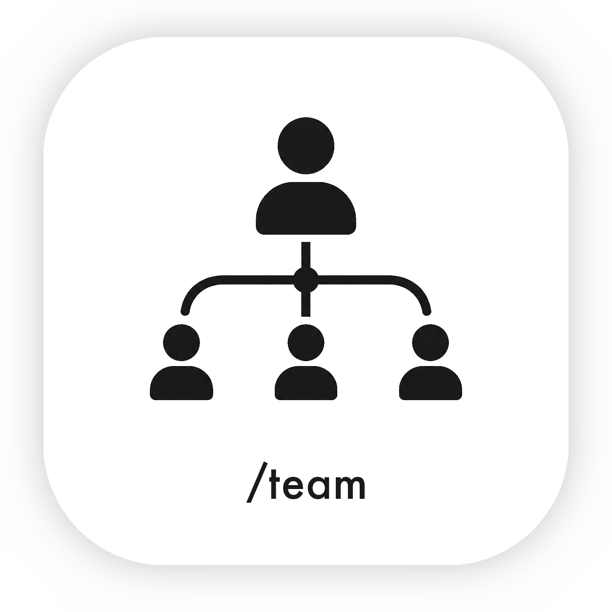

<p align="center">
  
</p>

# `/team` SKILL

> Don't be a manager! Be a product owner!
>
> Don't design your AI process and roles manually. Let AI design teams, roles, and whole processes for each task or feature, much better than you would.

`/team` is an extremely [simple and minimalistic (~3k characters)](./skills/team/SKILL.md), anti-micromanagement orchestration tool designed to autonomously take care of the whole implementation process. Don't be a manager, and don't design your AI flow or your subagents' roles. AI can do it for you. You don't have to be involved.

The core idea is to let AI dynamically design the implementation process because it knows better which subagents to spawn and with what roles.


## Usage

Type `/team`, then describe what you want done. Don't specify how it should be done.

By default, the flow is fully autonomous, but you can always add additional requirements or instructions.

If you need a brainstorming session, just ask for it. Feel free to use your favorite brainstorming skill.


## Installation

### OpenCode

Add `team-skill` to `opencode.json`:

```json
{
  "plugin": ["team-skill@git+https://github.com/kubenstein/team-skill.git"]
}
```

### Claude Code

```bash
npx skills@latest add kubenstein/team-skill
```

## Other solutions I've used

- [oh-my-opencode](https://github.com/code-yeongyu/oh-my-openagent) - the father of orchestration, but too complex and built around fixed roles.
- [superpowers](https://github.com/obra/superpowers) - not autonomous, too complex, and has a very rigid flow. The brainstorming skill is good, though.
- [mattpocock's skills](https://github.com/mattpocock/skills) - not autonomous and focused only on particular steps in the process. If you need a brainstorming skill, use it and then pass the work to `/team`.
- [ponytail](https://github.com/DietrichGebert/ponytail) - not autonomous, too complex, and feels like too much fixed LARPing. Let AI design that role for you.
- [caveman](https://github.com/JuliusBrussee/caveman) - a different purpose, so you can actually point `/team` at it to speak like a caveman to save tokens (`cavecrew` also fixes team roles).
- [gstack](https://github.com/garrytan/gstack) - not autonomous, too complex, and built around fixed roles.
